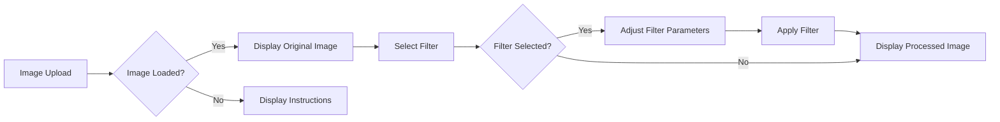

id: 6890fc472695e597ab528d2b_documentation
summary: Lab 2.1: PD Models - Development Documentation
feedback link: https://docs.google.com/forms/d/e/1FAIpQLSfWkOK-in_bMMoHSZfcIvAeO58PAH9wrDqcxnJABHaxiDqhSA/viewform?usp=sf_link
environments: Web
status: Published
# Streamlit Image Processing Application Codelab

This codelab guides you through understanding and utilizing a Streamlit application designed for image processing. Image processing is a crucial aspect of many fields, including computer vision, medical imaging, and remote sensing. This application provides a user-friendly interface to perform various image manipulations, making it an excellent tool for both beginners and experienced practitioners.

We'll cover core concepts like:

*   **Image Upload and Display:** How to handle image input and output within Streamlit.
*   **Image Filtering:** Implementing common image filters using libraries like OpenCV (cv2).
*   **User Interface Design:** Utilizing Streamlit components to create interactive controls.
*   **Image Format Conversion:** Converting images between different color spaces (e.g., RGB, grayscale).
*   **Deployment:** Understanding how to run and deploy a Streamlit application.

This application demonstrates a practical use case of Streamlit for creating interactive data science tools. By the end of this codelab, you'll be equipped to build your own image processing applications using Streamlit.

## Setting Up the Environment
Duration: 00:05

Before you start, ensure you have Python installed. We'll need to install Streamlit and OpenCV. Run the following commands in your terminal:

```bash
pip install streamlit opencv-python numpy
```

These commands will install the necessary libraries:

*   `streamlit`:  The core library for building the web application.
*   `opencv-python`:  A powerful library for image processing.
*   `numpy`: A fundamental package for numerical computation in Python, used extensively with OpenCV.

## Understanding the Application Structure
Duration: 00:10

Let's outline the basic structure of the Streamlit application. The application primarily consists of the following components:

1.  **Image Upload:** Allows users to upload an image.
2.  **Image Display:** Displays the original and processed images.
3.  **Filter Selection:** Provides a dropdown menu to select different image filters.
4.  **Filter Parameters:** Allows adjusting parameters specific to the chosen filter.
5.  **Image Processing Logic:** Applies the selected filter to the image.

Here's a conceptual flowchart of the application:



## Examining the Code: Image Upload and Display
Duration: 00:10

The first step is to handle image uploads and display the original image. Here's the relevant code snippet:

```python
import streamlit as st
import cv2
import numpy as np

def main():
    st.title("Image Processing App")

    uploaded_file = st.file_uploader("Upload an image", type=["jpg", "jpeg", "png"])

    if uploaded_file is not None:
        file_bytes = np.asarray(bytearray(uploaded_file.read()), dtype=np.uint8)
        img = cv2.imdecode(file_bytes, cv2.IMREAD_COLOR)

        st.image(img, channels="BGR", caption="Original Image", use_column_width=True)
    else:
        st.write("Please upload an image to start.")

if __name__ == "__main__":
    main()
```

Explanation:

*   `st.file_uploader()`: This Streamlit function creates a file upload widget. The `type` argument specifies the accepted file types (JPEG, JPG, and PNG).
*   The code checks if an image has been uploaded (`if uploaded_file is not None:`).
*   `np.asarray(bytearray(uploaded_file.read()), dtype=np.uint8)`: This converts the uploaded file into a NumPy array, which is the format OpenCV uses for images.
*   `cv2.imdecode()`:  This OpenCV function decodes the image from the NumPy array. `cv2.IMREAD_COLOR` specifies that the image should be read in color.
*   `st.image()`: This Streamlit function displays the image.  `channels="BGR"` is crucial because OpenCV uses BGR color order by default, while Streamlit expects RGB. `use_column_width=True` makes the image scale to fit the column.

## Implementing Image Filters
Duration: 00:20

Now, let's add functionality to apply image filters. We'll use OpenCV for this.

```python
import streamlit as st
import cv2
import numpy as np

def apply_filter(img, filter_type):
    if filter_type == "Grayscale":
        return cv2.cvtColor(img, cv2.COLOR_BGR2GRAY)
    elif filter_type == "Blur":
        return cv2.GaussianBlur(img, (15, 15), 0)
    elif filter_type == "Edge Detection":
        gray = cv2.cvtColor(img, cv2.COLOR_BGR2GRAY)
        edges = cv2.Canny(gray, 100, 200)
        return cv2.cvtColor(edges, cv2.COLOR_GRAY2BGR)  # Convert back to BGR for display
    else:
        return img  # No filter

def main():
    st.title("Image Processing App")

    uploaded_file = st.file_uploader("Upload an image", type=["jpg", "jpeg", "png"])

    if uploaded_file is not None:
        file_bytes = np.asarray(bytearray(uploaded_file.read()), dtype=np.uint8)
        img = cv2.imdecode(file_bytes, cv2.IMREAD_COLOR)

        st.image(img, channels="BGR", caption="Original Image", use_column_width=True)

        filter_type = st.selectbox("Select Filter", ["None", "Grayscale", "Blur", "Edge Detection"])

        processed_img = apply_filter(img, filter_type)

        st.image(processed_img, channels="BGR", caption=f"Processed Image ({filter_type})", use_column_width=True)
    else:
        st.write("Please upload an image to start.")

if __name__ == "__main__":
    main()
```

Explanation:

*   `apply_filter(img, filter_type)`: This function takes the image and the selected filter type as input.
*   `cv2.cvtColor(img, cv2.COLOR_BGR2GRAY)`: Converts the image to grayscale.
*   `cv2.GaussianBlur(img, (15, 15), 0)`: Applies a Gaussian blur filter. The `(15, 15)` is the kernel size (larger values mean more blur).  The `0` is the standard deviation, which is automatically calculated.
*   `cv2.Canny(gray, 100, 200)`: Performs edge detection using the Canny algorithm.  `100` and `200` are the threshold values.
*   `st.selectbox()`: Creates a dropdown menu to select the filter.
*   The processed image is displayed using `st.image()`.  The caption includes the name of the applied filter.  It is important to convert the grayscale image back to BGR before displaying it using `cv2.cvtColor(edges, cv2.COLOR_GRAY2BGR)`.

## Adding Parameter Adjustments
Duration: 00:25

Let's enhance the application by adding sliders to adjust filter parameters. For example, we can add a slider to control the blur intensity.

```python
import streamlit as st
import cv2
import numpy as np

def apply_filter(img, filter_type, blur_amount=15):
    if filter_type == "Grayscale":
        return cv2.cvtColor(img, cv2.COLOR_BGR2GRAY)
    elif filter_type == "Blur":
        return cv2.GaussianBlur(img, (blur_amount, blur_amount), 0)
    elif filter_type == "Edge Detection":
        gray = cv2.cvtColor(img, cv2.COLOR_BGR2GRAY)
        edges = cv2.Canny(gray, 100, 200)
        return cv2.cvtColor(edges, cv2.COLOR_GRAY2BGR)
    else:
        return img

def main():
    st.title("Image Processing App")

    uploaded_file = st.file_uploader("Upload an image", type=["jpg", "jpeg", "png"])

    if uploaded_file is not None:
        file_bytes = np.asarray(bytearray(uploaded_file.read()), dtype=np.uint8)
        img = cv2.imdecode(file_bytes, cv2.IMREAD_COLOR)

        st.image(img, channels="BGR", caption="Original Image", use_column_width=True)

        filter_type = st.selectbox("Select Filter", ["None", "Grayscale", "Blur", "Edge Detection"])

        blur_amount = 15  # Default value
        if filter_type == "Blur":
            blur_amount = st.slider("Blur Amount", min_value=3, max_value=51, step=2, value=15) # Ensure odd values

        processed_img = apply_filter(img, filter_type, blur_amount)

        st.image(processed_img, channels="BGR", caption=f"Processed Image ({filter_type})", use_column_width=True)
    else:
        st.write("Please upload an image to start.")

if __name__ == "__main__":
    main()
```

Key Changes:

*   The `apply_filter` function now accepts a `blur_amount` parameter.
*   A `st.slider()` is added when the "Blur" filter is selected. The slider allows users to adjust the blur intensity. The arguments are: `label`, `min_value`, `max_value`, `step` and `value`(default value).
*   The `blur_amount` slider is only displayed when the blur filter is selected. It's important to make the slider values odd to ensure that the Gaussian Blur kernel size is a valid value.
*   The `apply_filter` function is called with the adjusted `blur_amount`.

## Running the Application
Duration: 00:05

To run the application, save the code as a Python file (e.g., `image_processing.py`) and run the following command in your terminal:

```bash
streamlit run image_processing.py
```

This will start the Streamlit server and open the application in your web browser.

## Deployment Considerations

While this codelab focuses on functionality, consider these points for deployment:

*   **Cloud Platforms:** Streamlit applications can be deployed to cloud platforms like Heroku, AWS, Google Cloud, and Azure.
*   **Docker:** Using Docker can ensure consistent application behavior across different environments.  A `Dockerfile` would specify the Python environment and dependencies.
*   **Streamlit Sharing:** Streamlit provides a free sharing platform for deploying Streamlit applications.  This is a convenient option for smaller projects.

## Conclusion

This codelab has provided a step-by-step guide to building a Streamlit image processing application.  You've learned how to upload and display images, implement image filters, and add interactive parameter adjustments.  This knowledge forms a strong foundation for building more complex and sophisticated image processing tools using Streamlit. Remember to consult the Streamlit and OpenCV documentation for more advanced features and options.

